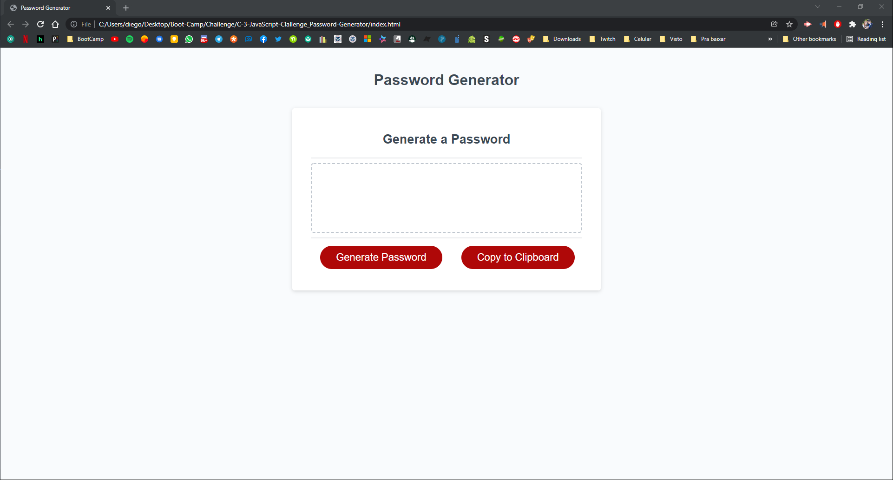
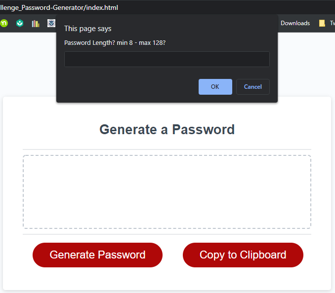
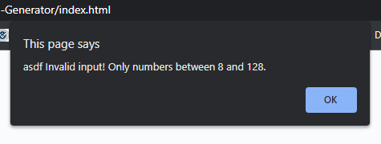
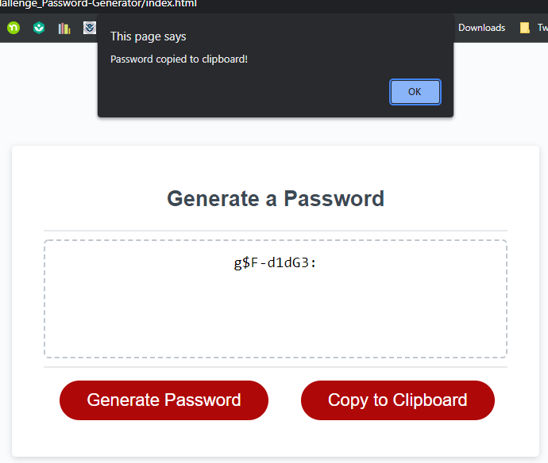

# Password Generator Starter Code Challenge 3

Targeted goals:

- Create an application to generate passwords using JavaScript
- Click the button "Generate Password" will trigger a series of prompts for password criteria
- Password length between 8 and 128 characters
- Password could include lowercase, uppercase, numeric and/or symbols
- Alert user when invalid criteria selected: only number
- Display generated password inside the text area
- Add a copy button

## Application deployed at URL:

https://kakudiego.github.io/C-3-JavaScript_Basic-Password-Generator/

## GitHub repository:

https://github.com/kakudiego/C-3-JavaScript_Basic-Password-Generator

### ScreenShots:

